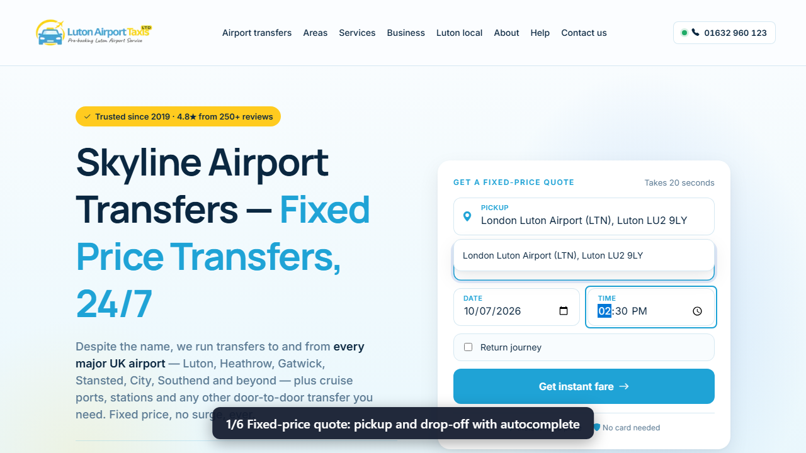
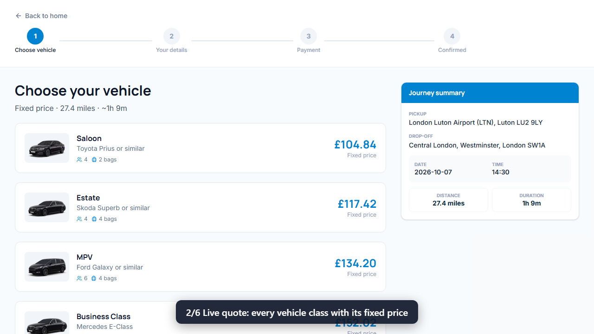
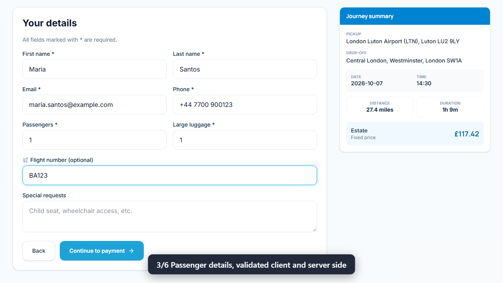
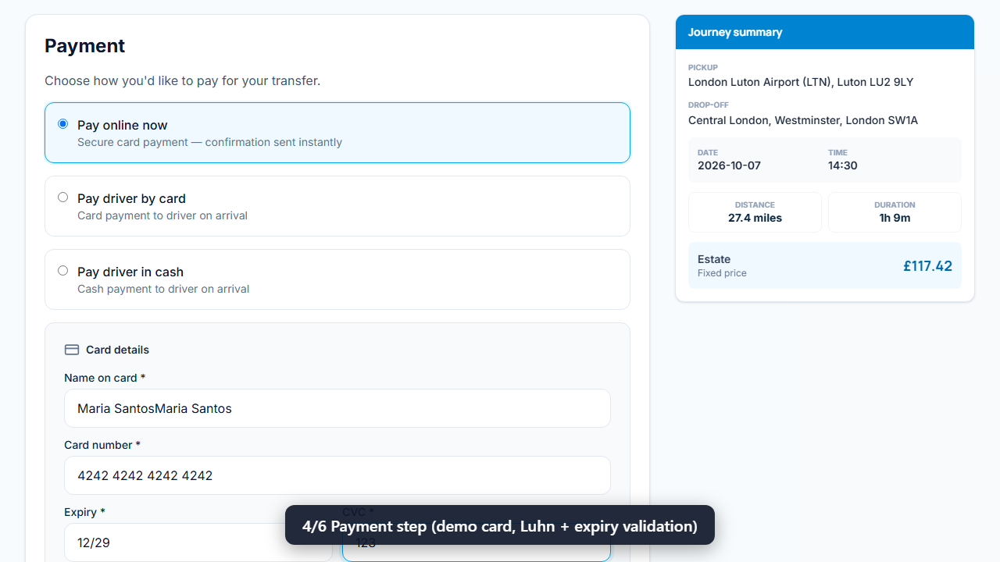
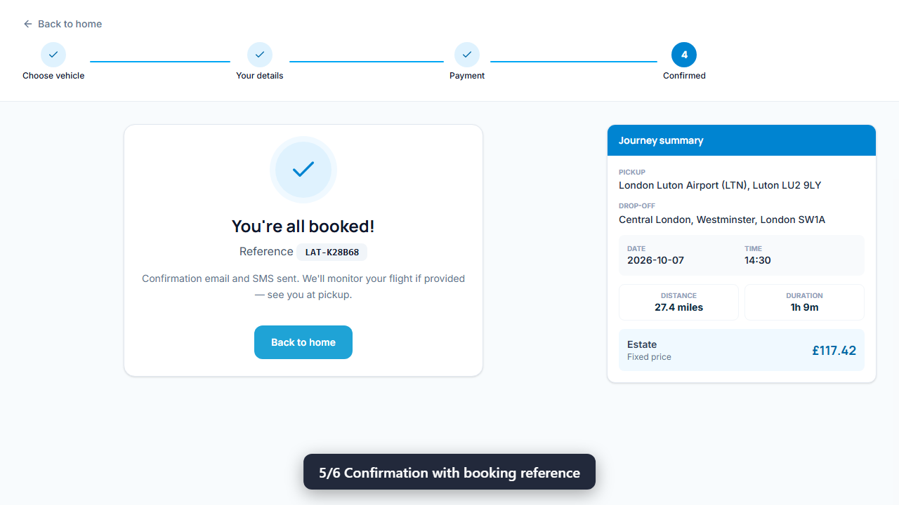
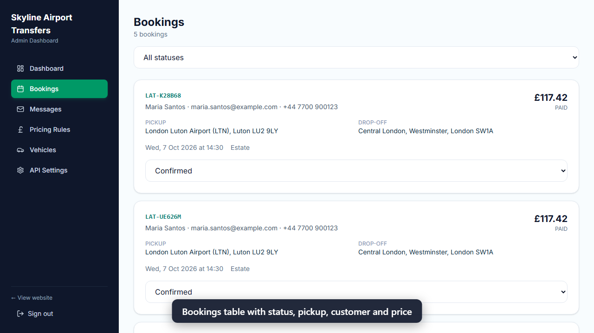

# Skyline Airport Transfers — Booking Platform

UK airport transfer booking platform by **Alexsandro Sunaga** (sample operator names, contact details, and reviews are fictional): marketing pages, quote widget, full booking flow, contact capture, and admin dashboard. **Next.js**, **Prisma**, **SQLite/PostgreSQL**, plus portfolio **FastAPI + product SPA** under `stack/` (see `stack/README.md`).

## Demo


Full 40-second walkthrough with captions: [docs/demo/booking-demo.mp4](docs/demo/booking-demo.mp4). Recorded from the real app running locally: quote, vehicle choice, validated passenger details, payment step, confirmation, then the booking appearing in the admin dashboard.

| Quote | Vehicles | Details |
|---|---|---|
|  |  |  |
| **Payment** | **Confirmation** | **Admin bookings** |
|  |  |  |

## Run locally

```bash
npm install
npm run db:push
npm run db:seed
npm run dev:fresh
```

Open **http://localhost:3001**

Run **one** dev server at a time. If you see missing `.next` files or 500 errors:

```bash
npm run dev:fresh
```

## Features

### Customer site
- Homepage and branded content pages (airports, routes, services, FAQs, contact)
- Quote widget with autocomplete (built-in UK places or Google Maps)
- Booking flow: vehicle → details → payment → confirmation
- Contact form stored in the database

### Admin
- **http://localhost:3001/admin**
- Bookings, pricing, vehicles, API settings, contact messages  
- Login user is seeded via `prisma/seed.ts` (configure with `.env`)

### APIs
- `POST /api/quote` — pricing  
- `GET /api/places` — autocomplete  
- `POST /api/bookings` — reservations  
- `POST /api/contact` — enquiries  
- Admin routes under `/api/admin/*`  
- FastAPI: `stack/api/` — `POST /api/v1/quote` on port **8010**
- Product SPA: `stack/product-web/` (Vite, transfer profile)

## Environment

Copy `.env.example` to `.env`:

```env
DATABASE_URL="file:./dev.db"
JWT_SECRET="your-secret"
ADMIN_EMAIL="admin@example.com"
ADMIN_PASSWORD="change-me"
GOOGLE_MAPS_API_KEY=""   # optional — built-in places work offline
```

## Performance notes

- Content pages use ISR where configured  
- Pricing rules cached in memory (invalidated on admin updates)  
- Quote endpoint runs distance and pricing work in parallel  

## Troubleshooting

```bash
npm run clean
npm run dev
```

If `npm install` fails with SSL errors on Windows:

```powershell
$env:NODE_OPTIONS="--use-system-ca"
npm install
```

## Structure

```
prisma/              # Database schema and seed
public/              # Static assets
src/app/             # Next.js pages, admin, API routes
src/components/      # Booking and layout UI
stack/
  api/               # FastAPI (quotes, bookings, Stripe)
  product-web/       # Vite product SPA (portfolio)
docs/                # Extra documentation
```

## Author

**Alexsandro Sunaga**

## License

MIT License — see [LICENSE](LICENSE).
